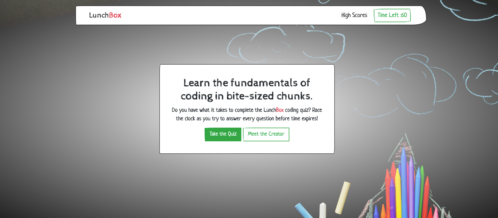
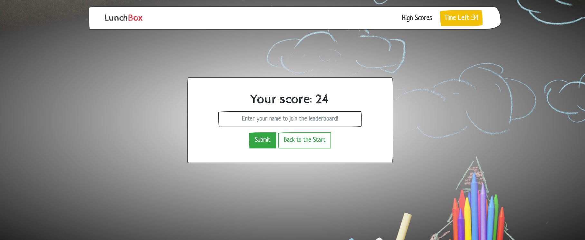

# LunchBox Code Quiz

This is an interactive quiz that tests your knowledge on Javascript coding fundamentals. Race the clock as you try to answer every question before time runs out! Be careful though—every wrong answer deducts 10 seconds from the clock!

- - -

## Resources Used

* Javascript
* HTML
* CSS
* Bootstrap
* Background by freepik: https://www.freepik.com/photos/background

- - -

## User Story

```
AS A student of coding
I WANT to take a timed quiz on JavaScript fundamentals that stores high scores
SO THAT I can gauge my progress compared to my peers
```

- - -

## Project Criteria

```
GIVEN I am taking a code quiz
WHEN I click the start button
THEN a timer starts and I am presented with a question
WHEN I answer a question
THEN I am presented with another question
WHEN I answer a question incorrectly
THEN time is subtracted from the clock
WHEN all questions are answered or the timer reaches 0
THEN the game is over
WHEN the game is over
THEN I can save my initials and score
```

- - -

## Screenshots



